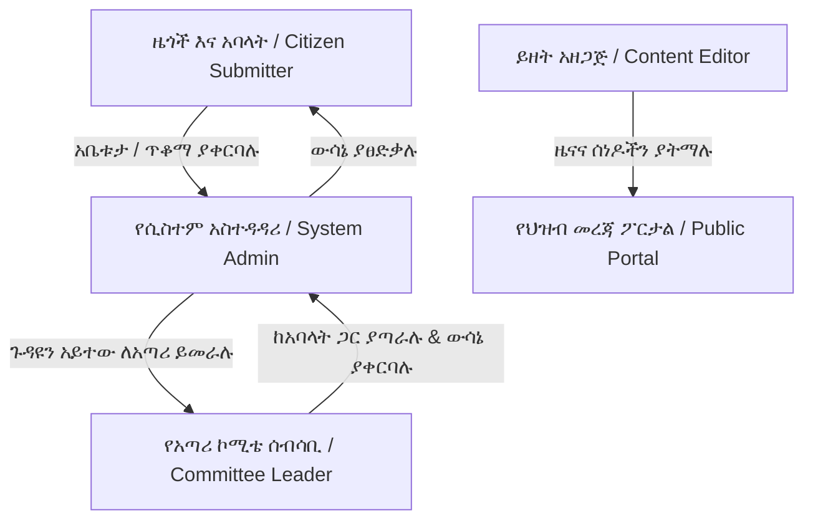
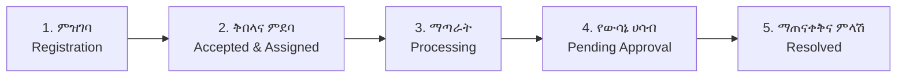
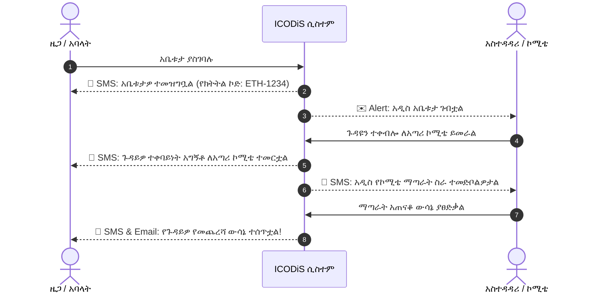
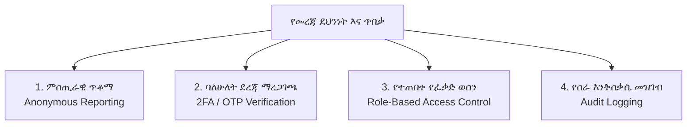
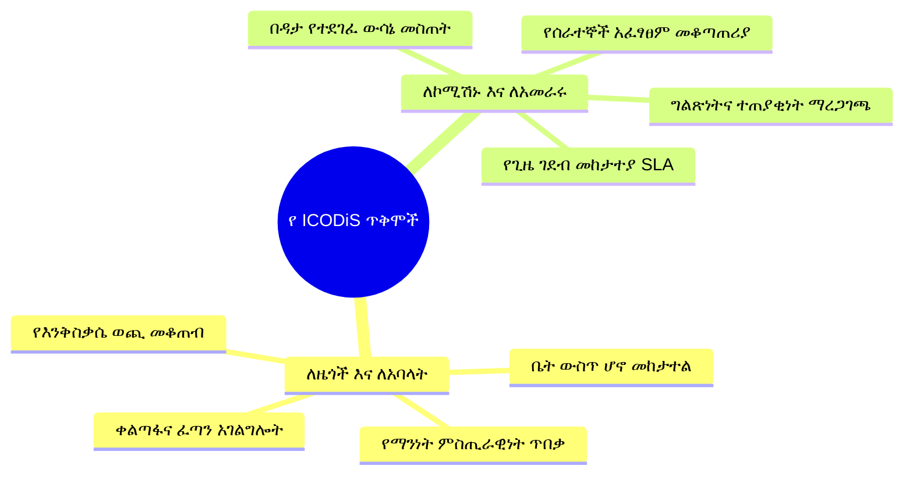

# የብልፅግና የኢንስፔክሽንና የሥነ-ምግባር ኮሚሽን ዲጂታል ሲስተም (ICODiS)
## አጠቃላይ የሲስተሙ የትውውቅና ማብራሪያ ፕሬዝዳንቴሽን (Presentation Deck for Non-Technical Audience)

---

## 📌 የፕሬዝዳንቴሽን ማውጫ (Table of Contents)

1. [ክፍል 1፡ መግቢያ እና የሲስተሙ ዋና ራዕይ (Executive Overview & Vision)](#-ክፍል-1-መግቢያ-እና-የሲስተሙ-ዋና-ራዕይ)
2. [ክፍል 2፡ አሁን ያለው ፈተና እና የዲጂታል ሲስተሙ መፍትሔ (The Challenge & Digital Solution)](#-ክፍል-2-አሁን-ያለው-ፈተና-እና-የዲጂታል-ሲስተሙ-መፍትሔ)
3. [ክፍል 3፡ የሲስተሙ ተጠቃሚዎች እና ድርሻዎች (User Roles & Stakeholders)](#-ክፍል-3-የሲስተሙ-ተጠቃሚዎች-እና-ድርሻዎች)
4. [ክፍል 4፡ የአቤቱታና ጥቆማ አያያዝ 5ቱ ዋና ደረጃዎች (5-Step Workflow)](#-ክፍል-4-የአቤቱታና-ጥቆማ-አያያዝ-5ቱ-ዋና-ደረጃዎች)
5. [ክፍል 5፡ ዋና ዋና የሲስተሙ ክፍሎች እና አገልግሎቶች (Core System Modules)](#-ክፍል-5-ዋና-ዋና-የሲስተሙ-ክፍሎች-እና-አገልግሎቶች)
6. [ክፍል 6፡ የራስ-ሰር ማሳወቂያዎች (SMS & Email Notification System)](#-ክፍል-6-የራስ-ሰር-ማሳወቂያዎች)
7. [ክፍል 7፡ የመረጃ ደህንነት፣ ምስጢራዊነት እና ተጠያቂነት (Security & Confidentiality)](#-ክፍል-7-የመረጃ-ደህንነት-ምስጢራዊነት-እና-ተጠያቂነት)
8. [ክፍል 8፡ የሲስተሙ ዋና ዋና ጥቅሞች እና ስትራቴጂካዊ ፋይዳ (Key Benefits & Impact)](#-ክፍል-8-የሲስተሙ-ዋና-ዋና-ጥቅሞች-እና-ስትራቴጂካዊ-ፋይዳ)
9. [ክፍል 9፡ ማጠቃለያ እና የቀጣይ አቅጣጫዎች (Conclusion & Next Steps)](#-ክፍል-9-ማጠቃለያ-እና-የቀጣይ-አቅጣጫዎች)

---

## 🎬 ክፍል 1፡ መግቢያ እና የሲስተሙ ዋና ራዕይ

> **"ጠንካራ ኢንስፔክሽን ለጠንካራ ፓርቲና ለላቀ የመንግሥት አገልግሎት!"**

### 1.1 የሲስተሙ ስም
**ICODiS (Inspection & Code of Ethics Commission Digital System)**  
*(የብልፅግና የኢንስፔክሽንና የሥነ-ምግባር ኮሚሽን የኦንላይን አቤቱታ፣ ጥቆማ፣ የምዘና እና የመረጃ ማሰራጫ ዲጂታል ፖርታል)*

### 1.2 የሲስተሙ ዋና አላማ
ይህ ዲጂታል ሲስተም የተዘረጋው፡
- **ዜጎች እና የፓርቲው አባላት** ያሏቸውን አቤቱታዎች እና ጥቆማዎች ከየትኛውም ቦታ ሆነው በኦንላይን፣ በግልጽነትና በምስጢር ማቅረብ እንዲችሉ ለማድረግ፣
- **የኮሚሽኑ አመራሮችና አጣሪ አካላት** የቀረቡ ጉዳዮችን በፈጣንና በተደራጀ መንገድ በመመርመር ተጠያቂነት ያለው ውሳኔ እንዲሰጡ ለማስቻል፣
- **የአገልግሎት አሰጣጥ ጥራትን** በዳታ እና በስታቲስቲክስ የተደገፈ በመመዘን የላቀ አሰራርን ለማረጋገጥ ነው።

---

## 💡 ክፍል 2፡ አሁን ያለው ፈተና እና የዲጂታል ሲስተሙ መፍትሔ

| አሁን ያለው የተለመደ አሰራር (ፈተናዎች) | የ ICODiS ዲጂታል ሲስተም መፍትሔ |
| :--- | :--- |
| **አካላዊ እንግልት እና ወጪ፡** ዜጎች አቤቱታ ለማቅረብ በአካል መገኘት አለባቸው። | **ከየትኛውም ቦታ ማቅረብ፡** በስልክ ወይም በኮምፒውተር በቤት ውስጥ ሆኖ ማቅረብ። |
| **የመረጃ መዘገየት እና መጥፋት፡** በወረቀት የቀረቡ ማመልከቻዎች ሊጠፉ ወይም ሊዘገዩ ይችላሉ። | **የተጠበቀ ዲጂታል መዝገብ፡** እያንዳንዱ ማመልከቻ በሲስተም ውስጥ በቋሚነት ይመዘገባል። |
| **የሂደት ግልጽነት ማነስ፡** አመልካቹ ጉዳዩ የት ደረጃ ላይ እንደደረሰ ለማወቅ ይቸገራል። | **ልዩ የመከታተያ ኮድ (Tracking Code)፡** በየደረጃው የጉዳዩን ሁኔታ በስልክ መከታተል ይቻላል። |
| **የክትትል እና ቁጥጥር እጥረት፡** ጉዳዮች በምን ያህል ጊዜ እንደተመለሱ ለማወቅ አስቸጋሪ ነው። | **የራስ-ሰር የጊዜ ገደብ (SLA Tracking)፡** ጉዳዩ ሳይዘገይ በጊዜው እንዲያልቅ የማሳሰቢያ መልዕክት ይላካል። |
| **የጥቆማ አቅራቢዎች ፍርሃት፡** ማንነቴ ይታወቅብኛል የሚል ስጋት። | **ምስጢራዊ የጥቆማ አሰራር (Anonymous Reporting)፡** ማንነት ሳይገለጽ ጥቆማ ማቅረብ ይቻላል። |

---

## 👥 ክፍል 3፡ የሲስተሙ ተጠቃሚዎች እና ድርሻዎች

ሲስተሙ 4 ዋና ዋና ተጠቃሚዎችን እና የስራ ድርሻዎችን ያቀፈ ነው፡

### 1. ዜጎች / የፓርቲው አባላት (Citizens & Members)
- አቤቱታ ወይም ጥቆማ በኦንላይን ያቀርባሉ፤
- ማስረጃዎችን (ፎቶ፣ ሰነድ፣ ቪዲዮ) ያያይዛሉ፤
- በሚሰጣቸው **ልዩ የመከታተያ ኮድ (Tracking Code)** የጉዳያቸውን ደረጃ ይከታተላሉ፤
- በኢሜይልና በኤስኤምኤስ (SMS) ወቅታዊ መረጃ ይደርሳቸዋል።

### 2. የሲስተም አስተዳዳሪ (System Admin)
- አዳዲስ የቀረቡ አቤቱታዎችን ይመረምራል፣ ይቀበላል፤
- ጉዳዮችን ለሚመለከተው **አጣሪ ኮሚቴ** ይመራል፤
- የተጠቃሚዎችን መለያ (User Accounts) እና የፈቃድ ወሰን (Permissions) ያቀናጃል፤
- አጠቃላይ የቁጥጥር ዳሽቦርድ (Dashboard) እና ስታቲስቲክስ ይከታተላል።

### 3. የአጣሪ ኮሚቴ መሪ እና አባላት (Committee Leaders & Members)
- የተመራላቸውን ጉዳይ ዝርዝር መረጃ እና ማስረጃ ይመረምራሉ፤
- የማጣራት ስራውን ሰርተው **የውሳኔ ሀሳብ (Decision Idea Summary)** ያዘጋጃሉ፤
- የውሳኔ ሀሳቡን ለአስተዳዳሪው እንዲጸድቅ ያቀርባሉ።

### 4. የይዘት አዘጋጅ (Content Editor)
- የኮሚሽኑን ዜናዎች፣ መግለጫዎች እና ይፋዊ ሰነዶች በፖርታሉ ላይ ያትማል፤
- የአመራር አካላትን መረጃ እና መዋቅር ያስተዳድራል።

---

## 🔄 ክፍል 4፡ የአቤቱታና ጥቆማ አያያዝ 5ቱ ዋና ደረጃዎች

አንድ አቤቱታ ወይም ጥቆማ ወደ ሲስተሙ ከገባበት ጊዜ ጀምሮ የመጨረሻ ውሳኔ እስከሚያገኝበት ድረስ የሚያልፍባቸው 5 ግልጽ ደረጃዎች፡

### 📌 ዝርዝር የሂደት መግለጫ፡

1. **ደረጃ 1፡ ምዝገባ (Registration / ደርሷል)**
   - ዜጋው በፖርታሉ ላይ ቅጹን ይሞላል።
   - ሲስተሙ ወዲያውኑ ልዩ የመከታተያ ኮድ (ለምሳሌ: `ETH-2026-X8K9`) ይፈጥራል።
   - ለዜጋው **SMS እና ኢሜይል** "አቤቱታዎ በስኬት ደርሶናል" የሚል መልዕክት ይላካል።

2. **ደረጃ 2፡ ቅበላና ምደባ (Acceptance & Assignment / ተቀብሏል)**
   - አስተዳዳሪው የቀረበውን ጉዳይ አይቶ ይቀበለዋል (Accept)።
   - ጉዳዩን ለማጣራት ተስማሚ የሆነ **አጣሪ ኮሚቴ** ይመድባል።
   - ለአቅራቢው "ጉዳይዎ ተቀባይነት አግኝቶ ለአጣሪ ኮሚቴ ተመርቷል" የሚል SMS ይላካል።

3. **ደረጃ 3፡ ማጣራትና ምርመራ (Processing / በማጣራት ላይ)**
   - የአጣሪ ኮሚቴ አባላት ሰነዶችን እና ማስረጃዎችን ይመረምራሉ።
   - ሲስተሙ ለጉዳዩ የተሰጠውን **የጊዜ ገደብ (SLA Deadline)** መቆጠር ይጀምራል፤ መዘገየት ካለ ማሳሰቢያ ይሰጣል።

4. **ደረጃ 4፡ የውሳኔ ሀሳብ ማቅረብ (Pending Approval / ለመጽደቅ የቀረበ)**
   - ኮሚቴው ማጣራቱን ጨርሶ የውሳኔ ሀሳብ (የጽሁፍ ማጠቃለያ እና የውሳኔ ሰነድ) ያዘጋጃል።
   - የውሳኔ ሀሳቡ ለኮሚሽን አስተዳዳሪዎች እንዲጸድቅ ይላካል።

5. **ደረጃ 5፡ ውሳኔ ማጽደቅ እና ምላሽ መስጠት (Resolved / ውሳኔ ተሰጥቷል)**
   - አስተዳዳሪው የውሳኔ ሀሳቡን አጽድቆ ጉዳዩን ያጠናቅቃል (Resolved)።
   - ለአቤቱታ አቅራቢው የመጨረሻው ውሳኔ በSMS እና በኢሜይል ይላካል።
   - አቅራቢው በተሰጠው አገልግሎት ላይ የርካታ ደረጃ (1 እስከ 5 ኮከብ) እና አስተያየት ይሰጣል።

---

## 🧩 ክፍል 5፡ ዋና ዋና የሲስተሙ ክፍሎች እና አገልግሎቶች

ይህ ዲጂታል ሲስተም የሚከተሉትን 8 ዋና ዋና ሞጁሎች (Modules) ያቀፈ ነው፡

### 1. የህዝብ አቤቱታና ጥቆማ ማስተናገጃ (Complaints & Suggestions Portal)
- ቀላል እና ማራኪ የቅጽ መሙያ ገጽ፤
- ፋይሎችን፣ ፎቶዎችን እና ማስረጃዎችን በቀላሉ ማያያዣ፤
- አቤቱታ ወይም ጥቆማ ብሎ የመለየት አማራጭ።

### 2. የጉዳይ መከታተያ ፖርታል (Case Tracking System)
- አመልካቾች ያለምንም አካውንት መግቢያ (No Login Required) በክትትል ኮዳቸው ብቻ ጉዳያቸው የት ደረጃ ላይ እንዳለ የሚያዩበት፤
- የሂደቱን ደረጃ በባር (Progress Bar) የሚያሳይ ገጽ።

### 3. የምዘና ፖርታል (Assessment Portal)
- የፓርቲው አባላት ወይም ተቋማት አገልግሎት አሰጣጥን እና አፈፃፀምን የሚመዝኑበት ዲጂታል ቅጽ፤
- የምዘና ውጤቶችን በራስ-ሰር የሚያሰላ እና ሪፖርት የሚያዘጋጅ።

### 4. የዜና፣ ህጎችና መመሪያዎች መረጃ ቋት (News & Documents Management)
- የኮሚሽኑን ይፋዊ መግለጫዎች እና ዜናዎች በሁለት ቋንቋ (አማርኛ እና እንግሊዝኛ) ማተሚያ፤
- ህጎችን፣ መመሪያዎችን እና ፖሊሲዎችን ዜጎች በነፃ የሚያወርዱበት (Download Center)።

### 5. የአመራር አካላት ማውጫ (Personnel Directory)
- የኮሚሽኑን ዋና ዋና አመራሮች፣ የቅርንጫፍ ጽ/ቤት ኃላፊዎችን እና የስራ ኃላፊነታቸውን የሚያሳይ መረጃ።

### 6. የQR ኮድ የተጠበቀ የሰነድ መዳረሻ (QR Code Access Management)
- ምስጢራዊ ወይም ከፍተኛ ጥበቃ የሚደረግላቸውን ሰነዶች በQR ኮድ እና በፈቃድ ጥያቄ (Approval System) ብቻ የማየት ደህንነት።

### 7. የስልጠና እና የአስተያየት ማስተናገጃ (Training & Feedback System)
- ለኮሚሽኑ ሰራተኞች የሚሰጡ ስልጠናዎችን ማስተዳደሪያ፤
- ከዜጎች የሚመጡ አጠቃላይ አስተያየቶችን እና የተጠቃሚ ርካታ መመዘኛ።

### 8. የቁጥጥር ሰሌዳ እና ስታቲስቲክስ (Admin Dashboard & Analytics)
- ለአመራሩ በአንድ ገጽ ላይ አጠቃላይ የተከናወኑ ስራዎችን፣ የቀረቡ አቤቱታዎችን ብዛት፣ የተጠናቀቁትን እና በሂደት ላይ ያሉትን በግራፍ የሚያሳይ።

---

## 🔔 ክፍል 6፡ የራስ-ሰር ማሳወቂያዎች (SMS & Email System)

ሲስተሙ በየደረጃው ለሚሳተፉ አካላት የራስ-ሰር አጭር የጽሁፍ መልዕክት (SMS) እና ኢሜይል ይልካል፡

### 📋 የሚላኩ የመልዕክት ምሳሌዎች፡

| ተቀባይ | የትዕይንት ሁኔታ | የመልዕክት ይዘት (በአጭሩ) |
| :--- | :--- | :--- |
| **አቤቱታ አቅራቢ ዜጋ** | አቤቱታ ሲመዘገብ | *"ያቀረቡት አቤቱታ በስኬት ተመዝግቧል። የመከታተያ ኮድዎ: ETH-8842 ነው። የሂደቱን ደረጃ ለመከታተል ይህን ይጫኑ: [Link]"* |
| **አቤቱታ አቅራቢ ዜጋ** | ውሳኔ ሲሰጥ | *"የአቤቱታዎ ማጣራት ስራ ተጠናቆ ውሳኔ ተሰጥቶበታል። ዝርዝር ውሳኔውን ለማንበብ ማስፈንጠሪያውን ይጫኑ፡ [Link]"* |
| **አጣሪ ኮሚቴ አባል** | ሲመደቡ | *"ለአቤቱታ ኮድ ETH-8842 አጣሪ ኮሚቴ አባል ሆነው ተመድበዋል። እባክዎን ወደ ሲስተም በመግባት ማጣራቱን ይጀምሩ።"* |
| **የኮሚቴ ሰብሳቢ** | የውሳኔ ሀሳብ ለመጽደቅ ሲላክ | *"የውሳኔ ሀሳብ ለመጽደቅ ቀርቧል። እባክዎን ዳሽቦርድ ላይ በመግባት ያፅድቁ።"* |

---

## 🔒 ክፍል 7፡ የመረጃ ደህንነት፣ ምስጢራዊነት እና ተጠያቂነት

### 1. ምስጢራዊ ጥቆማ (Anonymous Reporting)
- ጥቆማ አቅራቢዎች ስማቸውን፣ ስልካቸውን ወይም ኢሜይላቸውን ሳይገልጹ ጥቆማ ማቅረብ ይችላሉ።
- ሲስተሙ የጥቆማ አቅራቢውን ማንነት ሙሉ በሙሉ በጥበቃ ስር ያደርጋል።

### 2. ባለሁለት ደረጃ ማረጋገጫ (2FA / OTP Verification)
- የሲስተሙ አስተዳዳሪዎች እና አመራሮች ወደ ሲስተም ሲገቡ በስልካቸው በሚላክ የአንድ ጊዜ ማረጋገጫ ኮድ (OTP) መለያቸውን ይጠብቃሉ።

### 3. የተጠበቀ የፈቃድ ወሰን (Role-Based Access Control)
- እያንዳንዱ ሰራተኛ ማየት የሚችለው ለእሱ የተፈቀደለትን የስራ ክፍል መረጃ ብቻ ነው (ለምሳሌ፡ የይዘት አዘጋጅ አቤቱታዎችን ማየት አይችልም)።

### 4. የስራ እንቅስቃሴ መዝገብ (Audit Logging)
- ማን፣ መቼ፣ ምን እንደሰራ፣ የትኛውን ጉዳይ እንደቀየረ የሚያሳይ ዝርዝር የኮምፒውተር መዝገብ ይያዛል።

---

## 🚀 ክፍል 8፡ የሲስተሙ ዋና ዋና ጥቅሞች እና ስትራቴጂካዊ ፋይዳ

### 🌟 ለዜጎች እና ለፓርቲው አባላት፡
1. **ወጪና ጊዜ ይቆጥባል፡** በአካል ወደ ጽህፈት ቤት መመላለስ ይቀራል፤
2. **አስተማማኝ መከታተያ፡** ጉዳያቸው የት ደረጃ ላይ እንዳለ 24/7 ማወቅ ይችላሉ፤
3. **የመረጃ ደህንነት፡** ጥቆማ ሲሰጡ ማንነታቸው አይገለጽም።

### 🏛️ ለብልፅግና ኢንስፔክሽንና ሥነ-ምግባር ኮሚሽን፡
1. **የላቀ አሰራር እና ቀልጣፋ ስራ፡** ጉዳዮችን በኮምፒውተር መምራት እና መከታተል፤
2. **ተጠያቂነት እና ግልጽነት፡** የትኛው ጉዳይ በየትኛው ኮሚቴ ዘንድ እንደዘገየ በዳሽቦርድ ይታያል፤
3. **ትክክለኛ የስታቲስቲክስ ሪፖርት፡** በክልል፣ በዘርፍ እና በጉዳይ አይነት የተደራጀ ሪፖርት በአንድ ቁልፍ ማውጣት፤
4. **ተቋማዊ እምነትን መገንባት፡** ለዜጎች አቤቱታ ፈጣንና ፍትሃዊ ምላሽ መስጠት።

---

## 🎯 ክፍል 9፡ ማጠቃለያ እና የቀጣይ አቅጣጫዎች

### 📌 ማጠቃለያ
የ **ICODiS** ዲጂታል ሲስተም የብልፅግና የኢንስፔክሽንና የሥነ-ምግባር ኮሚሽንን አሰራር ወደ ዘመናዊና ግልጽ የቴክኖሎጂ ደረጃ የሚያሸጋግር፣ የዜጎችንና የአባላትን መብትና ድምፅ የሚያከብር፣ እንዲሁም የተቋሙን ተጠያቂነት የሚያረጋግጥ ሁለገብ ዲጂታል መድረክ ነው።

### 🔮 የቀጣይ አቅጣጫዎች (Next Steps)
1. **የአጠቃቀም ስልጠና መስጠት፡** ለአስተዳዳሪዎች እና ለአጣሪ ኮሚቴ አባላት ተግባራዊ የስራ ላይ ስልጠና መስጠት፤
2. **የህዝብ ግንዛቤ መፍጠር፡** ዜጎችና አባላት ፖርታሉን እንዲጠቀሙ በዜና እና በማህበራዊ ሚዲያ ማስተዋወቅ፤
3. **ቀጣይነት ያለው ክትትል፡** ከፖርታሉ የሚሰበሰቡ አስተያየቶችን መሰረት በማድረግ ሲስተሙን የበለጠ ማበልፀግ።

---

> **ለሰጡን ትኩረት እና ጊዜ እናመሰግናለን!**  
> **የብልፅግና የኢንስፔክሽንና የሥነ-ምግባር ኮሚሽን**  
> 🌐 **ፖርታል ሊንክ፡** [https://icods.raey.work](https://icods.raey.work)
